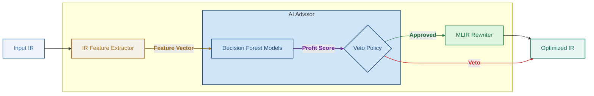

# TensorMorph

TensorMorph is an AI-driven MLIR optimizer designed to "morph" standard TOSA (Tensor Operator Set Architecture) graphs into hardware-efficient execution kernels. Unlike traditional compilers that rely on rigid heuristics, TensorMorph integrates **Specialized AI Advisors** that control the decision-making process—determining exactly what and when to optimize based on targeted hardware profiles.

While the AI makes the high-level decisions, the structural execution of those optimizations is handled by a robust, modular C++ transformation suite.


## The AI Decision-Making Layer
Optimization in TensorMorph is split into two distinct phases:
1. **The Veto Policy (AI)**: Before applying a transformation (like fusing an Add into a Conv2D), the optimizer extracts IR features (tensor shapes, kernel sizes, chain lengths) and queries an AI model. The AI predicts a profit ratio; if the score is below a user-defined threshold, the optimization is vetoed to prevent performance regression on specific hardware.
2. **The Execution Layer (MLIR)**: If the AI grants approval, TensorMorph executes the rewrite, manipulating the IR and baking mathematical effects directly into weights and biases.




For more details on how our AI advisors are trained and transpiled, see the [AI and Experimental README](./experimental/README.md).

## Transformation Suite

### Structural Fusion (Guided by AI)
* **Linear Math Folding**: Fuses `tosa.add`, `tosa.sub`, and `tosa.mul` layers into convolution anchors.
* **Padding Elimination**: Absorbs explicit `tosa.pad` operations into internal convolution attributes.
* **Transpose Folding**: Bakes input spatial permutations into weight constants at compile-time.
* **Activation Injection**: Fuses `tosa.clamp` (ReLU/ReLU6) operations directly into convolution attributes.
* **Fan-out Cloning**: Clones anchors with multiple consumers to enable multi-path fusion guided by AI profit predictions.

### Algebraic Folding (Deterministic)
* **Arithmetic Identities**: Automatically removes redundant operations such as $x + 0$ or $x \times 1$ without requiring AI intervention.

## Optimization and Advisor Flags

### Advisor Settings
| Flag | Default | Description |
| :--- | :--- | :--- |
| `ai-advisor` | `none` | Selects the profile: `memory` (Memory-Bound) or `compute` (Compute-Bound). **Setting this to `none` (default) means all optimizations will run greedily.** |
| `min-profit` | `1.2` | The minimum AI-predicted profit ratio required to trigger a fusion. |
| `debug-ai` | `false` | Enable detailed diagnostic logging to `stderr` to view AI scores and veto decisions. |

### Capability Toggles
| Flag | Default | Description |
| :--- | :--- | :--- |
| `fuse-linear` | `true` | Toggles the folding of Add/Sub/Mul into convolutions. |
| `fuse-padding` | `true` | Toggles the absorption of explicit Pad ops. |
| `fuse-transpose` | `true` | Toggles weight-based transpose folding. |
| `fuse-activations` | `true` | Toggles ReLU/Clamp fusion. |
| `fuse-fanout` | `true` | Toggles cloning for multi-user nodes. |
| `fold-algebraic` | `true` | Toggles pure math identities (x+0, etc). |

## Build and Usage

```bash
mkdir build && cd build
cmake .. -GNinja
ninja

# Run with Memory-Bound AI Advisor and scoring logs enabled
./bin/tensormorph-opt --tosa-opt="ai-advisor=memory min-profit=1.5 debug-ai=true" input.mlir
```

## Extending TensorMorph

To experiment with new optimizations or hardware targets, follow this developer workflow:

### 1. Implement the Logic
* **Patterns**: Define your new optimization pattern in `lib/Passes/TosaStructuralFusions.cpp`.
* **Features**: If your optimization requires new AI signals, update the feature extraction logic in `lib/experimental/TensorFeatures.cpp`.

### 2. Sandbox in TensorMorph-Lab
Use the provided Colab/Jupyter notebook for rapid iteration:
* **Define Test Case**: Add a custom TOSA MLIR graph in **Cell 3**.
* **Verify IR**: Run **Cell 4** to execute the optimizer and verify that your pattern triggers as expected.
* **Microbenchmark**: Use **Cell 7** to run the C++ inference verification and check the performance delta of your new optimization on the advisor models.

### 3. Validate
Run the integrated test runner to ensure no regressions:
```bash
python3 tests/run_tests.py
```
